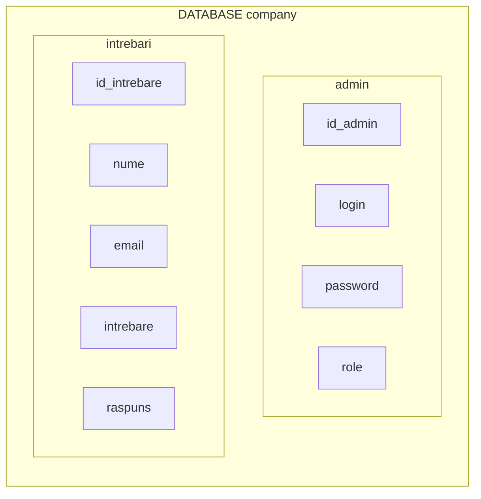

## Realizarea principiului FAQ(Întrebări frecvente) cu ajutorul limbajului PHP

În cadrul unui site este comod să fie realizat funcționalul FAQ. Fiecare pagină WEB oferă o colecție de informații cu un scop oarecare, însă informația poate fi expusă dubios pentru utilizator din careva motive.
Este probabil ca la utilizatori să apară aceleași întrebări. Astfel pentru a facilita lucrul celui/celora care răspund la întrebările adresate este eficient să fie realizat funcționalul FAQ.

Urmând firul logic reese că cineva trebuie să răspundă la întrebările puse. Aceștea sunt administratorii și moderatorii. Administratorii și moderatorii trebuie să acceseze pagina de **autorizare** pentru introducerea datelor necesare, ca mai apoi să dispună de access la **panoul de administrare**.

##

#### În cadrul acestui site vor fi 3 tipuri de utilizatori:
1.Vizitatori(utilizatorii finali) – cei pentru care a fost creată aplicația;
2.Administratori – proprietarii site-ului, dezvoltatorii;
3.Moderatorii – sunt de ajutor administratorilor cu drepturi limitate;
<![endif]-->

#### Funcționalul și posibilitățile pentru fiecare dintre utilizatori care necesită realizat:

1. Vizitatorul (utilizatorul) trebuie să:
	- acceseze paginile site-ului fără înregistrări și autentificări;
	- vizualizeze pagina cu înrebările frecvente;
	- adreseze întrebări prin formularul specializat;

2. Administratorul trebuie să:
	- posede toate posibilitățile vizitatorului;
	- acceseze panoul de administrare logânduse;
	-	posede posibilitatea de a adăuga noi administratori și moderatori în BD:
	- posede posibilitatea de a monitoriza întrebările și de a răspunde la ele;

3. Moderotorii trebuie să:
	- posede toate posibilitățile vizitatorului;
	- acceseze panoul de administrare logânduse;
	- posede posibilitatea de a răspunde la întrebări și să le vizualizeze;
	- fie lipsit de acces la panoul de administrare a administratorului;


**Întrebările și răspunsurile la ele trebuie să fie înscrise într-o bază de date. Baza de date se va numi ”company” cu 2 tabele – ”admin”, ”intrebari”.**

 


## Momente cheie
1. Validarea datelor introduse este realizat pe partea ***serverului (server-side validation)*** cu ajutorul PHP.<br>
Exemplu:
```php
$name = $email = $intreb = "";
$nameErr = $emailErr = $intrebErr = "";
if(isset($_REQUEST['intrebare'])){
        if ($_SERVER["REQUEST_METHOD"] == "POST") {
            $name = $email = $intreb = "";
            $nameErr = $emailErr = $intrebErr = "";
            $flagName = $flagEmail = $flagIntreb = false;
    
            if (empty($_POST["name"])){
            $nameErr = "Введите имя!";
            $flagName = false;
              } else {
                $name = test_input($_POST["name"]);
            if (!preg_match("/^[a-zА-Яа-я]{3,15}$/i", $name)) {
                $nameErr = "Имя не должно содержать цифр";
                $flagName = false;
                    }else $flagName = true;
              }
    
              if (empty($_POST["email"])){
            $emailErr = "Введите ваш email!";
            $flagEmail = false;
              } else {
                $email = test_input($_POST["email"]);
            if (!filter_var($email, FILTER_VALIDATE_EMAIL)) {
                  $emailErr = "Не правельный адресс!";
                    $flagEmail = false;
                    }else $flagEmail = true;
              }
    
              if (empty($_POST["ques"])){
            $intrebErr = "Введите вопрос";
            $flagIntreb = false;
              } else {
                $intreb = test_input($_POST["ques"]);
                if (!preg_match("/^[A-Za-zА-Яа-я ,.!?+*&0-9]{5,1000}$/i",$intreb)) {
                    $intrebErr = "Вопрос содержит запрещенные символы или слижком короткий!";
                    $flagIntreb = false;
                      }else $flagIntreb = true;
                }
              }

```
```html
<form action="<?php echo htmlspecialchars($_SERVER['PHP_SELF'])?>" method = "post">
	<input type="text" name="name" class="form-control" placeholder="Ваше имя " value="<?php echo $name;?>"><br>
	<input type="text" name="email" class="form-control" placeholder="Ваш email" value="<?php echo $email;?>"><br>
	<textarea  class="form-control"  rows="7" placeholder="Напишите ваш вопрос" name="ques" value="<?php echo $intreb ;?>"></textarea>
	<div class="justify-content-center text-center" style="margin-top:20px; padding:10px;">
        	<input type="submit" class="btn-primary justify-content-center text-center" value="Задать вопрос">
        </div>
</form>
```
2. Conectarea cu baza de date se realizează în cadrul fișierului connection.php. Ascet fișier este solicitat cu ajutorul **require_once** în cadrul fișierelor .php unde este necesară conectarea cu baza de date.
``` php
<?php

$servername = "localhost";

$username = "root";

$password = "";

$dbName = "company";

// Create connection

$connection = mysqli_connect($servername, $username, $password,$dbName);

// Check connection

if (!$connection) {

die("Connection failed: " . mysqli_connect_error());

}

?>
```
3.Panoul de administrare se accesează culegând în bara de adrese URL adresa relativă a fișierului **admin.php**.

4.Comenzile MySQL
- Întrebarea adresată de utilizator este culeasă după validare în variabila $intreb. În calitate de răspuns în câmpul ”raspuns” stocăm valoarea ”0” ceea ce semnifică o întrebare fără raspuns. 
```sql
INSERT  INTO intrebari (email, nume, intrebare, raspuns)
VALUES ('$email', '$name', '$intreb','0')";
``` 
- Sunt selectate câmpurile login, password și role din tabela admin. În câmpul role păstrăm rolul : 0 – moderator , 1 – administrator. În câmpul password parola se păstrează sub formă de MD5 Hash.
 ```sql
SELECT login,password,role FROM admin
```
```sql
SELECT * FROM admin WHERE role = 1
```
```sql
SELECT id_admin FROM admin WHERE role = 0.
```
- Selectăm întrebările fără răspuns.
```sql
SELECT * FROM intrebari WHERE raspuns = '0'
```
- Selectăm câmpul `role` din rândurile cărora corespunde  câmpul login cu variabila $log.
```sql
SELECT  role  FROM  admin  WHERE  login  = '$log'
```
