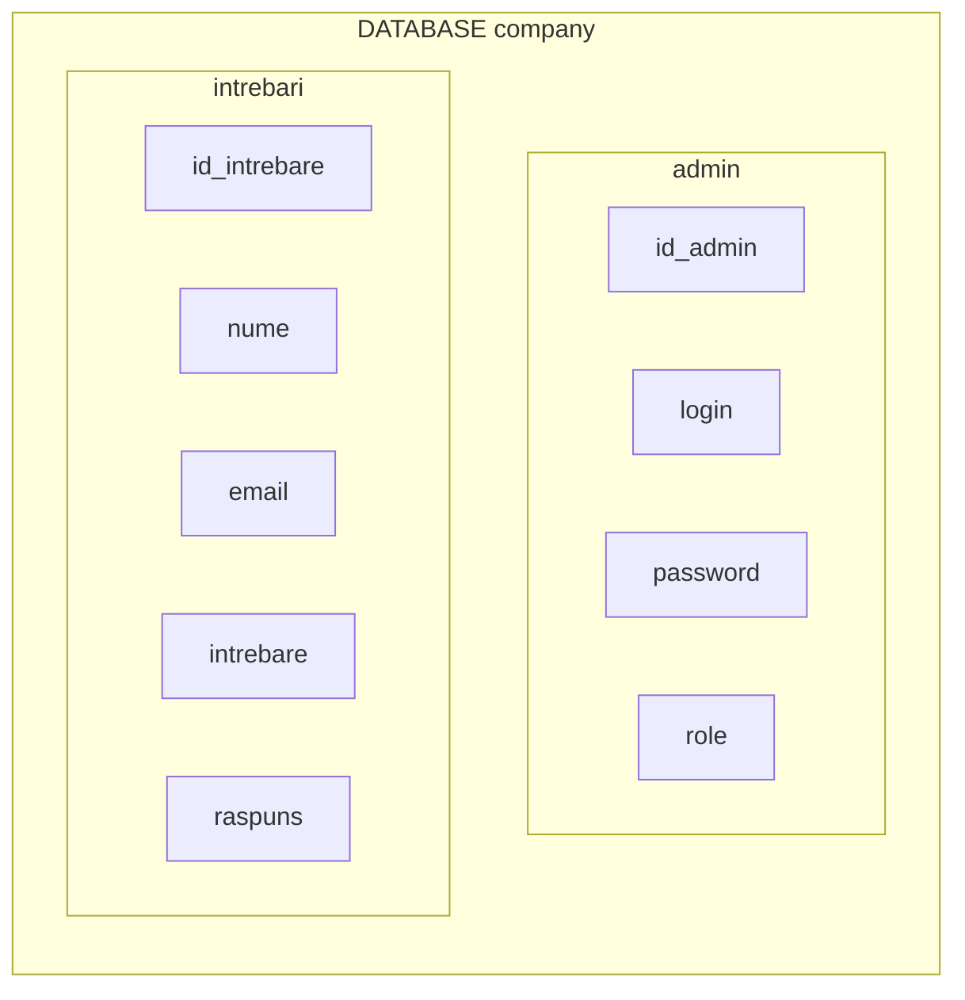

## Realizarea principiului FAQ(Întrebări frecvente) cu ajutorul limbajului PHP

În cadrul unui site este comod să fie realizat funcționalul FAQ. Fiecare pagină WEB oferă o colecție de informații cu un scop oarecare, însă informația poate fi expusă dubios pentru utilizator din careva motive.
Este probabil ca la utilizatori să apară aceleași întrebări. Astfel pentru a facilita lucrul celui/celora care răspund la întrebările adresate este eficient să fie realizat funcționalul FAQ.

Urmând firul logic reese că cineva trebuie să răspundă la întrebările puse. Aceștea sunt administratorii și moderatorii. Administratorii și moderatorii trebuie să acceseze pagina de **autorizare** pentru introducerea datelor necesare, ca mai apoi să dispună de access la **panoul de administrare**.

##

#### În cadrul acestui site vor fi 3 tipuri de utilizatori:
1.Vizitatori(utilizatorii finali) – cei pentru care a fost creată aplicația;
2.Administratori – proprietarii site-ului, dezvoltatorii;
3.Moderatorii – sunt de ajutor administratorilor cu drepturi limitate;
<![endif]-->

#### Funcționalul și posibilitățile pentru fiecare dintre utilizatori care necesită realizat:

1. Vizitatorul (utilizatorul) trebuie să:
	- acceseze paginile site-ului fără înregistrări și autentificări;
	- vizualizeze pagina cu înrebările frecvente;
	- adreseze întrebări prin formularul specializat;

2. Administratorul trebuie să:
	- posede toate posibilitățile vizitatorului;
	- acceseze panoul de administrare logânduse;
	-	posede posibilitatea de a adăuga noi administratori și moderatori în BD:
	- posede posibilitatea de a monitoriza întrebările și de a răspunde la ele;

3. Moderotorii trebuie să:
	- posede toate posibilitățile vizitatorului;
	- acceseze panoul de administrare logânduse;
	- posede posibilitatea de a răspunde la întrebări și să le vizualizeze;
	- fie lipsit de acces la panoul de administrare a administratorului;

**Întrebările și răspunsurile la ele trebuie să fie înscrise într-o bază de date. Baza de date se va numi ”company” cu 2 tabele – ”admin”, ”intrebari”.**

 

